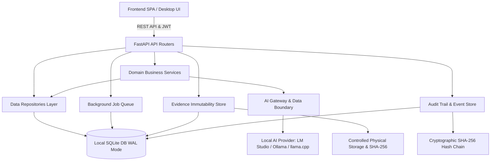

# FinAuditPro — Technical Architecture & Security Model

FinAuditPro is an offline-first, AI-assisted desktop audit application engineered for Indian Chartered Accountants, statutory auditors, and tax professionals.

---

## 1. High-Level Layered Architecture



---

## 2. Core Architectural Principles

### 1. Offline-First SQLite Foundation
- **Storage Engine:** SQLite 3 in WAL (`Write-Ahead Logging`) mode.
- **Constraints & Pragmas:** `PRAGMA foreign_keys = ON;`, `PRAGMA busy_timeout = 30000;`.
- **Zero Cloud Leakage:** Strictly no cloud telemetry, Redis, Celery, Kafka, or Kubernetes.

### 2. Versioned Database Migrations
- Tracked via `schema_migrations` table with SHA-256 file checksums and timestamp tracking.
- Location: `backend/migrations/`
  - `001_initial_schema.sql`
  - `002_performance_indexes.sql`
  - `003_evidence_and_jobs.sql`
- Executed in safe transactions (`BEGIN IMMEDIATE`) during application startup or via `apply_migrations()`.

### 3. Financial Precision & Money Quantization
- Application boundary calculations enforce canonical `Decimal` arithmetic.
- Explicit paise quantization via `Decimal('0.01')` using `ROUND_HALF_UP`.
- Utility functions in `backend/app/utils/money.py` guarantee zero binary floating point drift on debit/credit balancing, GST splits, reconciliation variances, and ledger aggregations.

### 4. Immutable Evidence Architecture
- Physical evidence files are decoupled from database metadata (`evidence_items`).
- Every upload computes a SHA-256 hash stored in the database.
- Path traversal protection via strict basename and root directory path resolution.
- Multi-version history (`_v2`, `_v3`) with parent tracking and audit replacement reasons.
- Physical integrity verification endpoint (`GET /api/evidence/verify/{id}`) checking expected vs actual disk SHA-256.

### 5. Tamper-Evident Append-Only Audit Trail
- Each event is cryptographically linked to the previous entry:
  $$\text{entry\_hash} = \text{SHA256}(\text{previous\_hash} \mid \text{timestamp} \mid \text{user\_id} \mid \text{username} \mid \text{action} \mid \text{module} \mid \text{record\_id} \mid \text{old\_value} \mid \text{new\_value} \mid \text{details} \mid \text{engagement\_id})$$
- Database triggers `trg_prevent_audit_log_update` and `trg_prevent_audit_log_delete` physically forbid modifying or deleting audit logs in SQLite.
- Full-chain verification via `verify_audit_trail_integrity()`.

### 6. AI Gateway & Strict Data Boundary
- Clean abstraction interface `BaseLocalAIProvider` implemented by `LMStudioProvider`, `BuiltinDeterministicAIProvider`, `OllamaProvider`.
- **AI Context Boundary:** Redacts PANs, GSTINs, bank accounts, emails, phone numbers, and entity names before prompting.
- Enforces engagement scoping and context length limits.
- **Advisory Invariant:** AI models can never directly mutate database transactions or audit records.

### 7. Background Job Processing
- Lightweight SQLite-backed queue `background_jobs` with thread pool executor (`JobManager`).
- States: `QUEUED`, `RUNNING`, `COMPLETED`, `FAILED`, `CANCELLED`.
- Handles large Excel/CSV ingestion, batch reconciliation, ML anomaly detection, and report rendering without blocking the UI.

### 8. System Integrity Diagnostics & Verified Backups
- Diagnostic dashboard (`/api/system/integrity`) checking DB health, foreign keys, schema status, audit chain validity, and evidence files.
- Manifest-backed backup archives (`.finpkg` / `.tar.gz`) containing DB snapshot, evidence files, and `manifest.json`.
- Pre-restore validation checking structure, checksums, and schema version before overwriting the active database.

---

## 3. Directory Structure

```
TempAudit-main/
├── backend/
│   ├── app/
│   │   ├── main.py                     # FastAPI application & router mounting
│   │   ├── auth.py                     # PBKDF2 authentication & JWT RBAC
│   │   ├── database.py                 # SQLite WAL connection & initialization
│   │   ├── schemas.py                  # Pydantic request/response schemas
│   │   ├── repositories/               # Data access layer
│   │   │   ├── transaction_repo.py
│   │   │   ├── engagement_repo.py
│   │   │   ├── evidence_repo.py
│   │   │   └── audit_repo.py
│   │   ├── routers/                    # REST API routers
│   │   │   ├── auth.py
│   │   │   ├── clients.py
│   │   │   ├── engagements.py
│   │   │   ├── transactions.py
│   │   │   ├── working_papers.py
│   │   │   ├── evidence.py
│   │   │   ├── jobs.py
│   │   │   ├── system.py
│   │   │   └── ...
│   │   ├── services/                   # Business logic engines
│   │   │   ├── anomaly_detection_engine.py
│   │   │   ├── bank_reconciliation_engine.py
│   │   │   ├── gst_reconciliation_engine.py
│   │   │   ├── integrity_checker.py
│   │   │   ├── backup_service.py
│   │   │   └── ...
│   │   ├── ai/                         # AI Gateway & boundary enforcement
│   │   │   ├── gateway.py
│   │   │   └── context_builder.py
│   │   ├── jobs/                       # Background job execution
│   │   │   └── job_manager.py
│   │   └── utils/                      # Utilities
│   │       ├── money.py
│   │       ├── audit_logger.py
│   │       └── pdf_generator.py
│   ├── migrations/                     # Versioned SQL migrations
│   │   ├── runner.py
│   │   ├── 001_initial_schema.sql
│   │   ├── 002_performance_indexes.sql
│   │   └── 003_evidence_and_jobs.sql
│   ├── finauditpro.db                  # Local SQLite database
│   ├── backups/                        # Backups & manifest bundles
│   ├── uploaded_files/                 # Physical evidence storage
│   └── tests/                          # Automated test suite (183 tests)
├── frontend/                           # SPA Frontend (HTML5 / CSS3 / Vanilla JS)
├── scripts/
│   └── e2e_full_audit_workflow.py     # 24-step autonomous E2E test suite
└── requirements.txt
```
