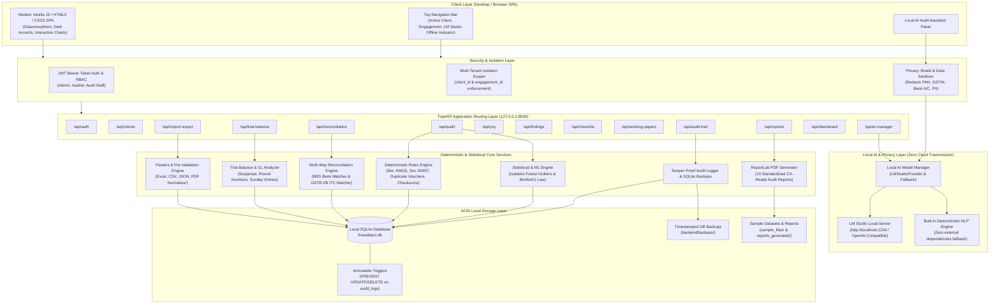

# FinAuditPro - System Architecture Diagram

```mermaid
flowchart TD
    subgraph Client_Layer ["Client Layer (Desktop / Browser SPA)"]
        UI["Modern Vanilla JS / HTML5 / CSS3 SPA\n(Glassmorphism, Dark Accents, Interactive Charts)"]
        TopNav["Top Navigation Bar\n(Active Client, Engagement, LM Studio Offline Indicator)"]
        ChatWidget["Local AI Audit Assistant Panel"]
    end

    subgraph Security_Gate ["Security & Isolation Layer"]
        AuthJWT["JWT Bearer Token Auth & RBAC\n(Admin, Auditor, Audit Staff)"]
        TenantScope["Multi-Tenant Isolation Scoper\n(client_id & engagement_id enforcement)"]
        PrivacyShield["Privacy Shield & Data Sanitizer\n(Redacts PAN, GSTIN, Bank A/C, PII)"]
    end

    subgraph API_Routers ["FastAPI Application Routing Layer (127.0.0.1:8000)"]
        R_Auth["/api/auth"]
        R_Clients["/api/clients"]
        R_Import["/api/import-export"]
        R_TB["/api/trial-balance"]
        R_Recon["/api/reconciliation"]
        R_Audit["/api/audit"]
        R_YoY["/api/yoy"]
        R_Findings["/api/findings"]
        R_Checklist["/api/checklist"]
        R_WP["/api/working-papers"]
        R_Reports["/api/reports"]
        R_AuditTrail["/api/audit-trail"]
        R_Dashboard["/api/dashboard"]
        R_AIMgr["/api/ai-manager"]
    end

    subgraph Core_Services ["Deterministic & Statistical Core Services"]
        S_Ingest["Parsers & Pre-Validation Engine\n(Excel, CSV, JSON, PDF Normalizer)"]
        S_TB["Trial Balance & GL Analyzer\n(Suspense, Round Numbers, Sunday Entries)"]
        S_Recon["Multi-Way Reconciliation Engine\n(BRS Bank Matcher & GSTR-2B ITC Matcher)"]
        S_Rules["Deterministic Rules Engine\n(Sec 40A(3), Sec 269ST, Duplicate Vouchers, Checksums)"]
        S_ML["Statistical & ML Engine\n(Isolation Forest Outliers & Benford's Law)"]
        S_PDF["ReportLab PDF Generator\n(10 Standardized CA-Ready Audit Reports)"]
        S_AuditTrail["Tamper-Proof Audit Logger & SQLite Backups"]
    end

    subgraph Local_AI_Engine ["Local AI & Privacy Layer (Zero Cloud Transmission)"]
        AI_Mgr["Local AI Model Manager\n(LMStudioProvider & Fallback)"]
        AI_LMStudio["LM Studio Local Server\n(http://localhost:1234 / OpenAI-Compatible)"]
        AI_Builtin["Built-in Deterministic NLP Engine\n(Zero external dependencies fallback)"]
    end

    subgraph Data_Storage ["ACID Local Storage Layer"]
        DB[(Local SQLite Database\nfinauditpro.db)]
        Triggers["Immutable Triggers\n(PREVENT UPDATE/DELETE on audit_logs)"]
        Backups["Timestamped DB Backups\n(backend/backups/)"]
        SampleFiles["Sample Datasets & Reports\n(sample_files/ & reports_generated/)"]
    end

    %% UI Connections
    UI --> Security_Gate
    TopNav --> Security_Gate
    ChatWidget --> PrivacyShield

    %% Security to Routers
    Security_Gate --> API_Routers

    %% Routers to Services
    R_Import --> S_Ingest
    R_TB --> S_TB
    R_Recon --> S_Recon
    R_Audit --> S_Rules
    R_Audit --> S_ML
    R_Reports --> S_PDF
    R_AuditTrail --> S_AuditTrail
    R_AIMgr --> AI_Mgr
    PrivacyShield --> AI_Mgr

    %% AI Providers
    AI_Mgr --> AI_LMStudio
    AI_Mgr --> AI_Builtin

    %% Services to Data Storage
    S_Ingest --> DB
    S_TB --> DB
    S_Recon --> DB
    S_Rules --> DB
    S_ML --> DB
    S_PDF --> SampleFiles
    S_AuditTrail --> DB
    DB --- Triggers
    S_AuditTrail --> Backups
```
